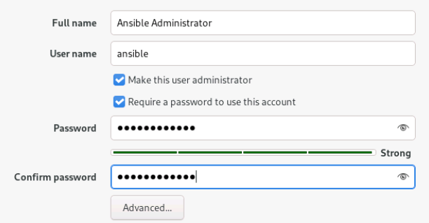

= AAP RPM Installation 2.5

Author: Juan Medina

Email: jumedina@redhat.com

== Requirements

You will need six machines running **Red Hat Enterprise Linux (RHEL) 9.2 or later**. The hostnames used in this environment are:

- `automationgateway.home.lab`
- `automationcontroller.home.lab`
- `automationhub.home.lab`
- `automationedacontroller.home.lab`
- `executionnode1.home.lab`
- `automationdatabase.home.lab`

[NOTE]
====
This setup is built for a sandbox environment.

The resource allocation below reflects approximately **half of the minimum** recommended CPU and memory for a production environment.
====

.Required System Specifications
[cols="1,2", options="header"]
|===
| Node Type | Recommended Resources (Sandbox)
| Control Nodes (e.g., controller)
| 16 GB RAM, 4 CPUs, 80 GB disk + 20 GB for `/var/lib/awx`
| Automation Hub
| 16 GB RAM, 4 CPUs, 40 GB disk + 40 GB for `/var/lib/pulp`
| Database
| 16 GB RAM, 4 CPUs, 40 GB disk + 200 GB for `/var/lib/pgsql`
| Platform Gateway
| 16 GB RAM, 4 CPUs, 40 GB disk
| Execution Nodes
| 16 GB RAM, 4 CPUs, 40 GB disk
| Hop Nodes
| 16 GB RAM, 4 CPUs, 40 GB disk
| EDA Controller
| 16 GB RAM, 4 CPUs, 40 GB disk
|===

.Required Software Versions

- `ansible-core` version **2.16** or later
- `Python` version **3.8** or later

== RHEL OS Installation

[NOTE]
====
You may follow the manual steps outlined below, or simply run the provided playbook `pre-setup.yml` to prepare the system.  

Run the playbook from the bastion host (the system where you will perform the AAP installation), using the designated installing user:

[source,bash]
----
$ ansible-playbook -i inventory.yml -K pre-setup.yml 
----
====

[WARNING]
====
Before running the playbook, review both your **inventory file** and the **playbook** itself to ensure they reflect the correct values for your environment.

Pay special attention to IP addresses, hostnames, credentials, and any other configuration-specific settings.
====

. Register the system to Red Hat Subscription Management (RHSM).
. Choose **"Minimal Install"** in the Software Selection screen.
. Under **Network & Hostname**, configure the system's identity:
+
Ideally, use a static IP address. However, in this sandbox environment, dynamic IPs will be used. Just ensure to manually set the **hostname** for each system:
+
- `automationcontroller.home.lab`
- `automationhub.home.lab`
- `automationdatabase.home.lab`
- `automationgateway.home.lab`
- `executionnode1.home.lab`
- `hopnode1.home.lab`
- `automationedacontroller.home.lab`
+
. Set a root password (in this environment, SSH access for root is allowed).
. Create the `ansible` user:
+

+
. All systems can remain with the default partitioning, **except for** the following roles: `Automation Controller`, `Automation Hub`, and `Automation Database`. For those systems, use a **custom storage configuration**:
.. Select the installation disk.
.. Click the link **"Click here to create them automatically"**, and ensure **LVM** is selected.
.. Adjust the logical volume sizes:
+
- Reduce the size of `/home` to ~5GB (or smaller if needed).
- Reduce the size of `/` (root) to ~40GB.
- Add a new logical volume as follows:
+
[cols="1,3", options="header"]
|===
| System Role | Custom Mount Point

| Automation Controller | `/var/lib/awx` (at least 20GB)
| Automation Hub        | `/var/lib/pulp` (at least 40GB)
| Automation Database   | `/var/lib/pgsql` (at least 200GB)
|===

Example:

image::../images/disk_conf_controller.png[align="center"]

== Bastion System

The bastion system can be either your own workstation or a virtual machine (VM) that can be decommissioned once the installation is complete.

. Obtain the IP addresses of all systems that will be part of the cluster. In my setup, I am using KVM Virtual Machines. To retrieve the IP addresses, I use the following command, which is filtered to provide clean output:
+
[source,shell]
----
$ virsh net-dhcp-leases default | awk '{print $5,$6}' | sed 's|/24||g' | grep '^1'
192.168.122.131 automationdatabase
192.168.122.141 automationgateway
192.168.122.187 automationcontroller
192.168.122.106 executionnode1
192.168.122.125 automationedacontroller
192.168.122.114 automationhub
----
+
[NOTE]
====
Although I haven't assigned static IPs, KVM leases IPs based on MAC addresses, ensuring that the IPs won't change over time.
====
+
. Register the system names in the host table of the bastion
+
To register the system names in the bastion's host table, include the following:

[source,shell]
----
include::rpm2.5.hosts[]
----
+
. Create an inventory file for the systems to be used with the pre-configuration.yml playbook
+
To create an inventory file, include the following systems in the file for use with the pre-configuration playbook:

[source,ini]
----
include::rpm2.5-inventory.yml[]
----

Before running the playbook to configure the requirements, we need to create an SSH key for the `ansible` user on the bastion system and distribute it across all systems in the AAP cluster.

. Generate the SSH key for the `ansible` user

[source,bash]
----
ssh-keygen -t rsa -b 4096
chmod 700 ~/.ssh
touch ~/.ssh/authorized_keys
chmod 600 ~/.ssh/authorized_keys
chown -R $USER:$USER ~/.ssh
----

. Copy the SSH key to all systems in the cluster

[source,bash]
----
ssh-copy-id -i ~/.ssh/id_rsa.pub automationcontroller.home.lab
ssh-copy-id -i ~/.ssh/id_rsa.pub automationgateway.home.lab
ssh-copy-id -i ~/.ssh/id_rsa.pub automationhub.home.lab
ssh-copy-id -i ~/.ssh/id_rsa.pub automationedacontroller.home.lab
ssh-copy-id -i ~/.ssh/id_rsa.pub automationdatabase.home.lab
ssh-copy-id -i ~/.ssh/id_rsa.pub executionnode1.home.lab
----

. Run the `pre-setup.yml` playbook with the following command:

[source,bash]
----
$ ansible-playbook -i inventory.yml -K pre-setup.yml
----

== Network Requirements

[%header,cols="1,5"]
|===
| Port Protocol   | Source -> Destination
| 22 TCP          | bastion                  -> all machines (temporary)
| 80/443 TCP      | automationedacontroller  -> automationhub
| 80/443 TCP      | automationedacontroller  -> automationcontroller
| 80/443 TCP      | automationcontroller     -> automationgateway
| 80/443 TCP      | automationcontroller     -> automationhub
| 80/443 TCP      | automationgateway        -> automationcontroller
| 80/443 TCP      | automationgateway        -> automationhub
| 80/443 TCP      | automationgateway        -> automationedacontroller
| 80/443 TCP      | bastion                  -> automationhub
| 80/443 TCP      | executionnode1           -> automationhub
| 80/443 TCP      | HAProxy LB               -> automationgateway
| 80/443 TCP      | HAProxy LB               -> automationcontroller
| 80/443 TCP      | HAProxy LB               -> automationedacontroller
| 5432 TCP        | automationedacontroller  -> automationdatabase
| 5432 TCP        | automationgateway        -> automationdatabase
| 5432 TCP        | automationhub            -> automationdatabase
| 5432 TCP        | automationcontroller     -> automationdatabase
| 6379 TCP        | automationedacontroller  -> automationgateway (redisnode)
| 6379 TCP        | automationgateway        -> automationgateway (redisnode)
| 8443 TCP        | automationgateway        -> automationgateway
| 8443 TCP        | automationgateway        -> edaexecutionnodes (*all)
| 16379 TCP       | redisnodes               -> redisnodes (*only redis clustered)
| 27199 TCP       | automationcontroller  <<-bi->> executionnode1 (*all execution nodes)
| 27199 TCP       | automationcontroller     -> hopnode (*all hop nodes)
| 27199 TCP       | automationcontroller     -> hybridnode (*all hybrid nodes)
| 27199 TCP       | executionnodes        <<-bi->> hopnode as required per distribution
|===

== Remotes

=== Red Hat Insights

- https://api.access.redhat.com:443       :: General account services and subscriptions
- https://cert-api.access.redhat.com:443  :: Insights data upload
- https://cert.console.redhat.com:443     :: Inventory upload and Cloud Connector connection
- https://console.redhat.com:443          :: Access to Insights dashboard

=== Automation Hub

- https://console.redhat.com:443          :: General account services and subscriptions
- https://catalog.redhat.com:443          :: Indexing execution environments
- https://sso.redhat.com:443              :: Single Sign-On (SSO) services
- https://automation-hub-prd.s3.amazonaws.com
- https://automation-hub-prd.s3.us-east-2.amazonaws.com

=== Firewall Access

- https://galaxy.ansible.com:443          :: Ansible Community curated content
- https://ansible-galaxy-ng.s3.dualstack.us-east-1.amazonaws.com :: Dual Stack IPv6 endpoint for Community curated Ansible content
- https://registry.redhat.io:443          :: Access to container images provided by Red Hat and partners
- https://cert.console.redhat.com:443     :: Red Hat and partner curated Ansible Collections

=== Execution Environments (EE)

- https://registry.redhat.io:443          :: Access to container images provided by Red Hat and partners
- cdn.quay.io:443 and cdn[01 to 06].quay.io:443 :: Access to container images provided by Red Hat and partners

== On Gateway and Hop Nodes

You are required to set the `umask` to `0022`.

== On Automation Hub

If you are using more than one Automation Hub Controller:

- Verify that the `/var/lib/pulp` directory is installed across your cluster as part of the shared storage file system installation.

If High Availability (HA) will be enabled:

- Ensure that you first install and configure `firewalld` to open the necessary ports required by your shared storage system before running the Ansible Automation Platform installer.

To install the `firewalld` daemon:

[source,bash]
----
$ dnf install firewalld
----

Add your network storage service and reload the firewall:

[source,bash]
----
$ firewall-cmd --permanent --add-service=<service>
$ firewall-cmd --reload
----

== On the database

To determine if your Automation Controller instance has access to the database, use the following command:

[source,bash]
----
$ awx-manage check_db
----

== Upgrade

Upgrade all systems and reboot

[source,shell]
----
dnf -y upgrade 
systemctl reboot
----

== Download AAP

*On the bastion*

Visit the following URL to download the required package:

https://access.redhat.com/downloads/content/480/ver=2.5/rhel---9/2.5/x86_64/product-software

- For online installations: Download **Ansible Automation Platform 2.5**.
- For offline or bundled installations: Download **Ansible Automation Platform 2.5 Setup Bundle**.

Copy the package to your system and extract it as the `ansible` user.

Also, copy the license zip file (Do **not** extract this one).

[source,bash]
----
$ scp ansible-automation-platform-containerized-setup-2.5-10.tar.gz ansible@aap.home.lab:~
$ scp c57ede26-dae3-4811-a854-2ed0f1a73c54.zip ansible@aap.home.lab:~
$ tar xfvz ansible-automation-platform-containerized-setup-*.tar.gz
$ cd ansible-automation-platform-containerized-setup-*
----

== Inventory for RPM Growth Topology

[source,yaml]
----
[automationgateway]
automationgateway.home.lab

[automationcontroller]
automationcontroller.home.lab 

[automationcontroller:vars]
node_type=control
peers=execution_nodes

[execution_nodes]
executionnode1.home.lab node_type=execution

[automationhub]
automationhub.home.lab

[automationedacontroller]
automationedacontroller.home.lab

[database]
automationdatabase.home.lab

[all:vars]
registry_username=<your RH username>
registry_password=<your RH password>
redis_mode=standalone
controller_license_file=/home/ansible/c57ede26-dae3-4811-a854-2ed0f1a73c54.zip
bundled=false
enable_insights_collection=true

# Automation Gateway
automationgateway_pg_host=automationdatabase.home.lab
automationgateway_pg_password=redhat123
automationgateway_admin_password=redhat123

# Automation Hub
automationhub_pg_host=automationdatabase.home.lab
automationhub_pg_password=redhat123
automationhub_admin_password=redhat123
automationhub_seed_collections=true

# Automation Event Driven Ansible Controller
automationedacontroller_pg_host=automationdatabase.home.lab
automationedacontroller_pg_password=redhat123
automationedacontroller_admin_password=redhat123

# Automation Controller
pg_host=automationdatabase.home.lab
pg_port=5432
pg_password=redhat123
admin_password=redhat123
----

== Installation 

Start the installation process with the following command:

[source,shell]
----
export ANSIBLE_BECOME_METHOD='sudo'
export ANSIBLE_BECOME=True
./setup.sh -i inventory-growth
----

[IMPORTANT]
====
*Go get a coffee!*
====
